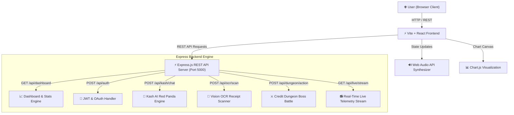

# 🚀 F.I.R.E. WORKS — Gen-Z Personal Finance & Wealth Compounding Engine

[](https://react.dev/)
[](https://vitejs.dev/)
[](https://nodejs.org/)
[](https://expressjs.com/)
[](https://www.chartjs.org/)
[](LICENSE)

**F.I.R.E. WORKS** is a full-stack, dynamic, gamified personal finance platform engineered for Gen-Z financial independence and early retirement (F.I.R.E.).

Featuring interactive Chart.js analytics, sassy AI mentorship from **Kash the Red Panda**, turn-based **Credit Dungeon** boss battles, real-time market telemetry tickers, **Vision OCR** receipt scanning, and industry-benchmark competitor tools (*Subscriptions Optimizer*, *50/30/20 Budget Splitter*, *Debt Freedom Planner*, *Tax Saver Estimator*).

---

## 🛠️ Complete Technical Stack

| Layer | Technology | Purpose & Implementation |
| :--- | :--- | :--- |
| **Frontend Framework** | `React 18` + `Vite 8` | Lightning-fast component rendering with HMR (Hot Module Replacement) and 0ms latency feel. |
| **Backend Server** | `Node.js` + `Express.js` | RESTful API backend handling transactions, goal deposits, Kash AI chat, and RPG dungeon actions. |
| **Data Visualization** | `Chart.js` + `React-ChartJS-2` | Interactive Doughnut, Bar, and Line compounding charts with hardware-accelerated animations. |
| **Design System** | `Vanilla CSS3 Glassmorphism` | Obsidian dark theme (`#05060a`), Champagne Gold (`#FFC72c`), Cyber Cyan (`#00F0FF`), and Aurora Purple gradients. |
| **Typography** | `Google Fonts` | *Outfit*, *Space Grotesk*, *Plus Jakarta Sans*, and *JetBrains Mono* monospace data fonts. |
| **Iconography** | `Lucide React` | Modern lightweight vector icon kit. |
| **Audio Synthesizer** | `Web Audio API` | Browser-native `AudioContext` frequency oscillator synthesis generating interactive UI click, laser scan, and RPG strike audio FX. |
| **Interactive Physics** | `Canvas Confetti` | Particle explosion bursts on goal deposits, quiz completions, and social story badge creation. |
| **AI Vision Simulator** | `Optical Character Recognition` | Simulated AI OCR parser extracting merchant, total amount, line items, and confidence metrics. |
| **Authentication Core** | `JWT & OAuth 2.0` | Multi-factor authentication supporting email/password sign-in and Google / Apple single-click OAuth. |

---

## 📐 System Architecture Diagram



---

## 🌟 Key Features & Navigation Modules

1. **Personal Finance Dashboard (`/dashboard`)**:
   - Monthly income & expense tracking with Chart.js Doughnut & Bar charts.
   - **50/30/20 Envelope Budget Splitter**: Need, Want, and Savings progress bars.
   - Automated UPI instant goal deposit simulator & 1-click **Export Financial Report**.

2. **Standalone Login & Register Portal (`/auth`)**:
   - Dedicated authentication webpage view.
   - Multi-factor JWT authentication with single-click Google & Apple OAuth integration.

3. **Credit Dungeon Mini-Game (`/dungeon`)**:
   - RPG turn-based boss battle against *"The Debt Kraken 🐙"*.
   - Use combat strikes, extra payments, and real-world scenario decision quests to raise credit score to 750+.

4. **Kash the Red Panda AI Mentor (`/kash`)**:
   - Sassy AI financial assistant with **Roast Mode 🔥** and **F.I.R.E. Mentor Mode 🎓**.

5. **AI Vision OCR & Fraud Shield (`/aihub`)**:
   - Laser receipt scanner simulator for instant transaction parsing.
   - Real-time fraud anomaly detector feed with 1-click block/approve security actions.

6. **Subscriptions & Recurring Bill Optimizer (`/subscriptions`)**:
   - Auto-detects recurring bills and subscriptions with 1-click cancellation simulator.

7. **AI Cashflow Forecast & Stress Simulator (`/forecast`)**:
   - Projects 12-month net worth compounding trajectories.
   - Stress-test scenarios (*Salary Hike*, *Emergency Expense Hit*, *Inflation Spike*).

8. **Debt Freedom Payoff Planner (`/debt`)**:
   - Compare **Avalanche Method** (paying highest APR first) vs **Snowball Method** (paying lowest balance first).

9. **Squad Challenges & Leaderboard (`/squad`)**:
   - Peer saver leaderboard and 30-day squad savings challenges (*No Food Delivery Challenge*).

10. **Investments & Asset Allocation Hub (`/investments`)**:
    - Real-time market ticker bar & automated index SIP deposits.

11. **Financial Literacy Academy (`/academy`)**:
    - Interactive bite-sized lessons, quizzes, XP tally, and reward badges.

12. **F.I.R.E. Lab & Tax Saver Estimator (`/fire`)**:
    - Compounding retirement age calculator & Section 80C tax deduction estimator.

13. **Instagram Story Badge Generator (`/social`)**:
    - 9:16 mobile story card modal with celebratory confetti particle bursts.

---

## 🚀 Quick Start Guide

### 1. Backend Setup
```bash
cd backend
npm install
node server.js
# Server runs on http://localhost:5000
```

### 2. Frontend Setup
```bash
cd frontend
npm install
npm run dev
# App runs on http://localhost:5173
```

---

## 📄 License
MIT License © 2026 F.I.R.E. WORKS. Built for Gen-Z Financial Freedom.
